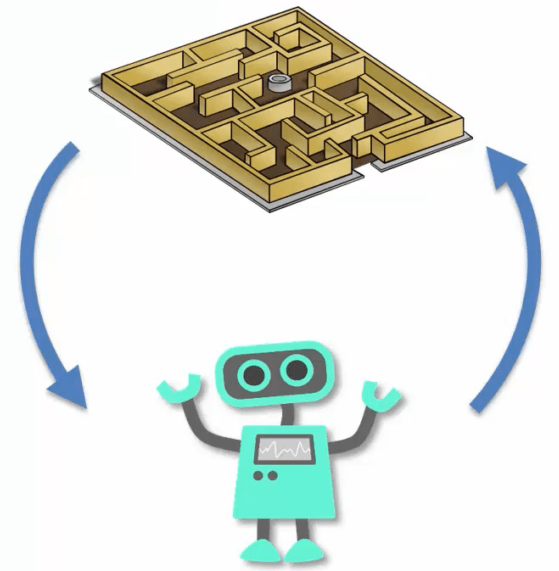

# RL HEV Agent
> Reinforcement Learning (RL) Agent for intelligent management of a Hybrid Electric Vehicle (HEV) Powertrain

## Table of contents
* [General info](#general-info)
* [Screenshots](#screenshots)
* [Technologies](#technologies)
* [Setup](#setup)
* [Features](#features)
* [Status](#status)
* [Inspiration](#inspiration)
* [Contact](#contact)

## General info
* The objective of this project is to code a Reinforcement Learning Agent able to manage the complex HEV Powertrain.
* The agent will work based on a number of reward shaping systems, i.e., a system of systems in a cybernetic way.
* Precisely this is going to be a Deep Q-Network agent.
* The reward shaping systems are as following:
    * charge-discharge;
    * fuel consumption map;
    * electric motor (EM) efficiency map;
    * electric generator (EG) efficiency map.
    ## Screenshots


## Technologies
* Tech 1 - Plain _Python_ and its specialized lybraries;
* Tech 2 - _Keras_;
* Tech 3 - _TensorFlow_.

## Setup
Keep the scripts, files and modules in the same folder.
Also, some additional modules must be imported, i.e., fuel consumption simulator and electric motor efficiency map generator from the corresponding repos of this developer.

## Code Examples
Show examples of usage (just an example):
* Import fuel consumption simulator as a _Python module.
```
import sfc.py as sfc
```
* Call the specific fuel consumption simulator with the appropriated args.
```
sfc = sfc(arg1, arg2,  ...)
```

## Features
List of features ready and TODOs for future development
* Project started, README partially done.

To-do list:
* ~~Get ready the README file, with project outline.~~
* ~~Compute transmission final ratio based on vehicle max speed, rolling radius and ICE max speed.~~
* Collect/determine the needed technical data of both the classical (ICE) and HE vehicles.
* ~~Rework of the electric motor (EM) efficiency map script to be RL agent ready.~~
* ~~Code the script for the generator efficiency map.~~
* ~~Code the charge-discharge reward system.~~
* ~~Code inverter efficiency script.~~
* ~~Code power flows efficiency.~~
* ~~Code the specific fuel consumption reward system.~~
* ~~Code the EM reward system.~~
* ~~Code the EG reward system.~~
* Code a function/class in order to get the HEV powertrain status at a certain timestep.
* Code the data gathering part of the RL agent.
* Assemble all the reward shaping systems.
* Code the neural network in order to model the DQ part.
* Train the agent and collect output.
* Collect vehicle parameters for testing.
* Code the WLTP cycle in order to get the road test parameters for a certain vehicle.
* Test the vehicle according to WLTP cycle, only Internal Combustion Engine powertrain.
* Test the vehicle according to WLTP cycle, HE powertrain.
* Results and analysis.

## Status
Project is: _in progress_.

## Inspiration
1) https://www.researchgate.net/publication/308830029_Efficiency_maps_of_electrical_machines
2) Ben-Chaim, Michael and Shmerling, Efraim. A Model of Vehicle Fuel Consumption at Conditions of the EUDC. International Journal of Mechanics.
3) Ben-Chaim, Michael, Shmerling, Efraim and Kuperman, Alon. Analytic Modeling of Vehicle Fuel Consumption. mdpi.com/journal/energies, 2013.
4) Schoen, Alexander et al. A Machine Learning Model for Average Fuel Consumption in Heavy Vehicles.
5) K. Wanner, T. Mundinger, and M. Weber, “Das 48-V-System von Mercedes-Benz,” ATZextra, vol. 23, no. 1, pp. 34–39, 2018, https://doi.org/10.1007/s35778-018-0004-0.
6) J. Strenkert, C. Schildhauer, and M. Richter, “Der neue Diesel-Plug-in-Hybrid von Mercedes-Benz,” MTZ - Motortechnische Zeitschrift, vol. 79, no. 4, pp. 46–51, 2018, https://doi.org/10.1007/s35146-018-0005-y.
7) J. Nun, A. Wieler, C. Andres, and T. Betz, “Der erste Vierzylinder-Dieselmotor von Mercedes-Benz mit RDE Stufe 2,” MTZ - Motortechnische Zeitschrift, vol. 80, no. 7, pp. 52–61, 2019, https://doi.org/10.1007/s35146-019-0081-7.
8) O. Vollrath, O. Storz, P. Lautenschütz, and K. Buchholz, “Der neue Mercedes-Benz-Reihensechszylinder-Ottomotor mit 48-V-Elektrifizierung,” MTZ - Motortechnische Zeitschrift, vol. 79, no. 5, pp. 60–67, 2018, https://doi.org/10.1007/s35146-018-0014-x.
9) T. Gödecke, C. Schildhauer, F. Weinert, and A. Frick, “Der Plug-in-Hybridantrieb für Kompaktwagen von Mercedes-Benz,” MTZ - Motortechnische Zeitschrift, vol. 80, no. 11, pp. 32–41, 2019, https://doi.org/10.1007/s35146-019-0127-x.
10) T. Eder, P. Lückert, M. Kemmner, and H. Sass, “OM 654 — Start einer neuen Motorenfamilie bei Mercedes-Benz,” MTZ - Motortechnische Zeitschrift, vol. 77, no. 3, pp. 62–69, 2016, https://doi.org/10.1007/s35146-015-0184-8.
11) C. Dörr, H. Kalczynski, A. Rink, and M. Sommer, “Das Neungang-Automatikgetriebe 9G-Tronic von Mercedes-Benz,” ATZ - Automobiltechnische Zeitschrift, vol. 116, no. 1, pp. 40–45, 2014, https://doi.org/10.1007/s35148-014-0012-3.

## Contact
rdt333@gmail.com - feel free to contact me!
